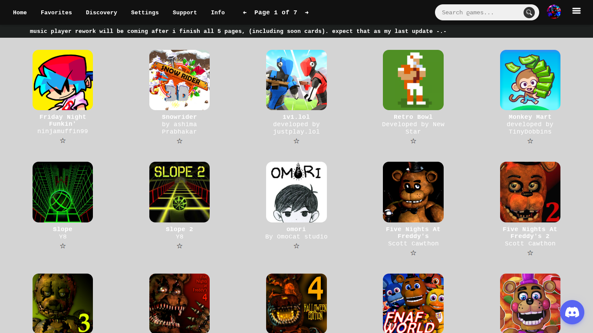

# Welcome to Wanna5mile!
- uses google sheets api for asset block building
- final version (v1) will contain 750 assets.
- check out archived versions and downloads to open it up locally.
  
## Preview v0.8


# Contributors:
<p align="left">
  
  
  
  
  
  
  
  
  
</p>

# credits
- @skysethelimit for the library (400+ projects) \
  CHECK OUT SELENITE HERE: [selenite.cc](https://selenite.cc)
  Join their [discord server](https://discord.gg/WDZhkdFyF4) to support selenite :)
- @genizy for the ports <3 
- @WilardzySenpai for the loading screen
- @tw31122007 for source Library!
- bguhm & sl4ckrr & slackerish are all accounts under the ownership of rhap5ody. (wanna5mile)

check out socials <a href="">HERE</a>

## License
```
MIT License

Copyright (c) 2025 Slackerish R5

Permission is hereby granted, free of charge, to any person obtaining a copy
of this software and associated documentation files (the "Software"), to deal
in the Software without restriction, including without limitation the rights
to use, copy, modify, merge, publish, distribute, sublicense, and/or sell
copies of the Software, and to permit persons to whom the Software is
furnished to do so, subject to the following conditions:

The above copyright notice and this permission notice shall be included in all
copies or substantial portions of the Software.

THE SOFTWARE IS PROVIDED "AS IS", WITHOUT WARRANTY OF ANY KIND, EXPRESS OR
IMPLIED, INCLUDING BUT NOT LIMITED TO THE WARRANTIES OF MERCHANTABILITY,
FITNESS FOR A PARTICULAR PURPOSE AND NONINFRINGEMENT. IN NO EVENT SHALL THE
AUTHORS OR COPYRIGHT HOLDERS BE LIABLE FOR ANY CLAIM, DAMAGES OR OTHER
LIABILITY, WHETHER IN AN ACTION OF CONTRACT, TORT OR OTHERWISE, ARISING FROM,
OUT OF OR IN CONNECTION WITH THE SOFTWARE OR THE USE OR OTHER DEALINGS IN THE
SOFTWARE.
```
<!--
Suggestions & Bug fixes

All suggestions are welcome to be continued to be asked of me, I will do as much as I can to include everyone’s suggestions and get sources for the assets people want to enjoy the most. And of course I will be swift to deliver with bug fixes and new content, fair well for now but not forever!

Hide or Don’t show again

Click the buttons at the bottom but know that either if you read or not you can click “don’t show again” without any worry to forget or miss out on the announcement, I will be adding the page link to the header! 

“Announcement” <—-
-->
